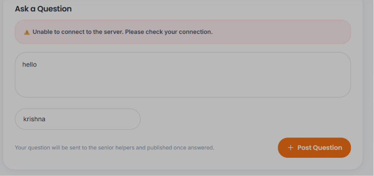

# 🚀 Bluehost VPS Deployment & Management Guide
<!-- CI/CD Automated Test Push Trigger: Detached Async Webhook Delivery -->

This guide provides a step-by-step walkthrough for deploying the entire **Freshers-Hub** project on a **Bluehost Ubuntu 24.04 VPS**.

It covers all 4 main components of your application stack:
1. **React Frontend** (User Interface)
2. **PostgreSQL Database** (`rit_freshers_hub`)
3. **Spring Boot Java Backend** (Core API - Port `8085`)
4. **Go Chatbot Microservice** (Q&A Search Engine - Port `8081`)
5. **Python Telegram & Discord Bot** (Integration Engine)
6. **Nginx Web Server** (Reverse Proxy & Traffic Router - Port `80` / `443`)

---

## 📑 Table of Contents
- [Step 1: Connect to your Bluehost VPS via SSH](#step-1-connect-to-your-bluehost-vps-via-ssh)
- [Step 2: Install System Software](#step-2-install-system-software)
- [Step 3: Set Up the PostgreSQL Database](#step-3-set-up-the-postgresql-database)
- [Step 4: Clone Your GitHub Repository](#step-4-clone-your-github-repository)
- [Step 5: Build & Run Component 1 (Go Chatbot Microservice)](#step-5-build--run-component-1-go-chatbot-microservice---port-8081)
- [Step 6: Build & Run Component 2 (Spring Boot Java Backend)](#step-6-build--run-component-2-spring-boot-java-backend---port-8085)
- [Step 7: Build & Run Component 3 (Python Telegram Bot)](#step-7-build--run-component-3-python-telegram-bot)
- [Step 8: Build Component 4 (React Frontend)](#step-8-build-component-4-react-frontend)
- [Step 9: Configure Nginx (Traffic Routing)](#step-9-configure-nginx-traffic-routing-on-port-80)
- [Step 10: Configure Firewall & Free HTTPS (SSL)](#step-10-configure-firewall--optional-free-https-ssl)
- [Step 11: Maintenance & Day-to-Day Cheat Sheet](#step-11-maintenance--day-to-day-cheat-sheet)

---

## Step 1: Connect to your Bluehost VPS via SSH

Open **PowerShell** or **Command Prompt** on your Windows PC and connect to your VPS:

```bash
ssh root@YOUR_SERVER_IP
```
*(Replace `YOUR_SERVER_IP` with your actual server IP provided by Bluehost. Type `yes` if prompted, then enter your SSH password).*

---

## Step 2: Install System Software

Copy and paste this entire block into your server terminal and press `Enter`. It will install Java 21, Node.js 20, Go, Python, PostgreSQL, and Nginx:

```bash
# Update Ubuntu package repository
sudo apt update && sudo apt upgrade -y

# Install Git, Curl, Build Tools, Nginx, PostgreSQL
sudo apt install -y git curl wget unzip build-essential nginx postgresql postgresql-contrib systemd

# Install Java 21 (For Spring Boot)
sudo apt install -y openjdk-21-jdk

# Install Go (For Go Chatbot Service)
sudo apt install -y golang-go

# Install Python 3 & Virtual Environment tools (For Telegram Bot)
sudo apt install -y python3 python3-pip python3-venv

# Install Node.js 20 LTS & npm (For React Frontend)
curl -fsSL https://deb.nodesource.com/setup_20.x | sudo -E bash -
sudo apt install -y nodejs
```

Verify software versions:
```bash
java -version
node -v
go version
python3 --version
```

---

## Step 3: Set Up the PostgreSQL Database

Create the PostgreSQL database required by your Spring Boot backend (`rit_freshers_hub`):

1. **Access PostgreSQL prompt:**
   ```bash
   sudo -u postgres psql
   ```

2. **Execute these SQL queries one by one:**
   ```sql
   CREATE DATABASE rit_freshers_hub;
   ALTER USER postgres WITH PASSWORD 'jouganxd1011';
   GRANT ALL PRIVILEGES ON DATABASE rit_freshers_hub TO postgres;
   \q
   ```

---

## Step 4: Clone Your GitHub Repository

Navigate to `/var/www` and clone your project repository:

```bash
cd /var/www
sudo git clone https://github.com/Amudieshwar-AG/Freshers-Hub.git freshers-hub
cd freshers-hub
```

---

## Step 5: Build & Run Component 1 (Go Chatbot Microservice - Port 8081)

1. **Compile the Go binary:**
   ```bash
   cd /var/www/freshers-hub/chatbot-service
   go build -o chatbot-service main.go
   ```

2. **Create its 24/7 background system service:**
   ```bash
   sudo nano /etc/systemd/system/chatbot.service
   ```

   Paste the following configuration:
   ```ini
   [Unit]
   Description=Go Chatbot Microservice
   After=network.target

   [Service]
   User=root
   WorkingDirectory=/var/www/freshers-hub/chatbot-service
   ExecStart=/var/www/freshers-hub/chatbot-service/chatbot-service
   Restart=always

   [Install]
   WantedBy=multi-user.target
   ```
   *(Press `Ctrl + O`, then `Enter` to save, and `Ctrl + X` to exit).*

3. **Start the Go Chatbot Service:**
   ```bash
   sudo systemctl daemon-reload
   sudo systemctl enable chatbot
   sudo systemctl start chatbot
   ```

---


   ```bash
   cd /var/www/freshers-hub/backend
   chmod +x mvnw
   ./mvnw clean package -DskipTests
   ```
   *(Your compiled file will be generated at `/var/www/freshers-hub/backend/target/portal-0.0.1-SNAPSHOT.jar`)*.

2. **Create its 24/7 background system service:**
   ```bash
   sudo nano /etc/systemd/system/springboot.service
   ```

   Paste the following configuration:
   ```ini
   [Unit]
   Description=Spring Boot Backend Service
   After=postgresql.service network.target

   [Service]
   User=root
   WorkingDirectory=/var/www/freshers-hub/backend
   Environment="DB_PASSWORD=jouganxd1011"
   ExecStart=/usr/bin/java -Xmx512m -jar /var/www/freshers-hub/backend/target/portal-0.0.1-SNAPSHOT.jar
   SuccessExitStatus=143
   Restart=always

   [Install]
   WantedBy=multi-user.target
   ```
   *(Press `Ctrl + O`, then `Enter` to save, and `Ctrl + X` to exit).*

3. **Start the Spring Boot Backend:**
   ```bash
   sudo systemctl daemon-reload
   sudo systemctl enable springboot
   sudo systemctl start springboot
   ```

---

## Step 7: Build & Run Component 3 (Python Telegram Bot)

1. **Set up Virtual Environment & Install dependencies:**
   ```bash
   cd /var/www/freshers-hub/telegram-bot
   python3 -m venv venv
   source venv/bin/activate
   pip install -r requirements.txt
   ```

2. **Create its 24/7 background system service:**
   ```bash
   sudo nano /etc/systemd/system/telegram-bot.service
   ```

   Paste the following configuration:
   ```ini
   [Unit]
   Description=Telegram & Discord Bot Service
   After=network.target springboot.service

   [Service]
   User=root
   WorkingDirectory=/var/www/freshers-hub/telegram-bot
   ExecStart=/var/www/freshers-hub/telegram-bot/venv/bin/python telegram_bot.py
   Restart=always

   [Install]
   WantedBy=multi-user.target
   ```
   *(Press `Ctrl + O`, then `Enter` to save, and `Ctrl + X` to exit).*

3. **Start the Telegram Bot:**
   ```bash
   sudo systemctl daemon-reload
   sudo systemctl enable telegram-bot
   sudo systemctl start telegram-bot
   ```

---

## Step 8: Build Component 4 (React Frontend)

1. **Install npm dependencies and build static assets:**
   ```bash
   cd /var/www/freshers-hub
   npm install
   npm run build
   ```
   *(This builds all production files into `/var/www/freshers-hub/dist`).*

---

## Step 9: Configure Nginx (Traffic Routing on Port 80)

Nginx serves your React website on Port 80 and transparently routes `/api/` calls to Spring Boot (8085) and `/api/chat` calls to the Go Chatbot (8081).

1. **Edit default Nginx config:**
   ```bash
   sudo nano /etc/nginx/sites-available/default
   ```

2. **Delete everything inside and paste this complete block:**

   ```nginx
   server {
       listen 80;
       server_name YOUR_SERVER_IP;

       # 1. Serve React Frontend Static Files
       location / {
           root /var/www/freshers-hub/dist;
           index index.html index.htm;
           try_files $uri $uri/ /index.html;
       }

       # 2. Route Spring Boot Backend APIs
       location /api/ {
           proxy_pass http://localhost:8085/api/;
           proxy_set_header Host $host;
           proxy_set_header X-Real-IP $remote_addr;
           proxy_set_header X-Forwarded-For $proxy_add_x_forwarded_for;
           proxy_set_header X-Forwarded-Proto $scheme;
       }

       # 3. Route Go Chatbot APIs
       location /api/chat {
           proxy_pass http://localhost:8081/api/chat;
           proxy_set_header Host $host;
           proxy_set_header X-Real-IP $remote_addr;
           proxy_set_header X-Forwarded-For $proxy_add_x_forwarded_for;
           proxy_set_header X-Forwarded-Proto $scheme;
       }
   }
   ```
   *(Replace `YOUR_SERVER_IP` with your Bluehost server IP address).*

3. **Test configuration and restart Nginx:**
   ```bash
   sudo nginx -t
   sudo systemctl restart nginx
   ```

---

## Step 10: Configure Firewall & (Optional) Free HTTPS (SSL)

1. **Enable Ubuntu Firewall:**
   ```bash
   sudo ufw allow OpenSSH
   sudo ufw allow 'Nginx Full'
   sudo ufw enable
   ```

2. **(Optional) Enable Free SSL/HTTPS with Certbot:**
   If you have a domain pointed to your server IP:
   ```bash
   sudo apt install -y certbot python3-certbot-nginx
   sudo certbot --nginx -d yourdomain.com
   ```

---

## Step 11: Maintenance & Day-to-Day Cheat Sheet

### Check status of all services:
```bash
sudo systemctl status springboot
sudo systemctl status chatbot
sudo systemctl status telegram-bot
sudo systemctl status nginx
```


* **Spring Boot logs:** `sudo journalctl -u springboot -f`
* **Telegram Bot logs:** `sudo journalctl -u telegram-bot -f`
* **Go Chatbot logs:** `sudo journalctl -u chatbot -f`

### 🔄 How to pull new GitHub updates in the future (1-Line Command):

Run this single command anytime you push new changes to GitHub:

```bash
cd /var/www/freshers-hub && git pull && npm run build && cd backend && ./mvnw clean package -DskipTests && sudo systemctl restart springboot chatbot telegram-bot nginx
```
