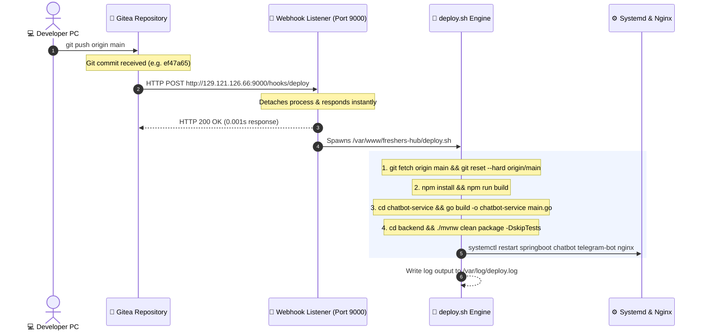

# 🚀 Gitea Webhook Automated CI/CD Pipeline Documentation

> **Project:** RIT Freshers Hub (`RIT-nexus`)  
> **Server:** Ubuntu 24.04 VPS (`129.121.126.66`)  
> **Architecture:** Zero-Timeout Asynchronous Webhook & Systemd Microservices  

---

## 📌 1. High-Level Architecture & Interaction Flow

The CI/CD pipeline automatically deploys code from your local machine to the production VPS server whenever a commit is pushed to the `main` branch on Gitea.



---

## ⚙️ 2. Detailed Component Breakdown

### Component 1: Local Developer Environment (`git push`)
* **Role:** Where you write code, test locally, and initiate deployments.
* **Trigger Action:**
  ```bash
  git commit -m "feat(topic): your changes"
  git push origin main
  ```
* **Target Remote:** `https://git.rit-services.in/ShanmugaKrishnanSM/RIT-nexus.git`

---

### Component 2: Gitea Remote Repository (`git.rit-services.in`)
* **Role:** Code hosting, version control, and event trigger dispatcher.
* **Webhook Configuration:**
  * **Location:** Repository ➔ **Settings** ➔ **Webhooks**
  * **Target URL:** `http://129.121.126.66:9000/hooks/deploy`
  * **HTTP Method:** `POST`
  * **Content Type:** `application/json`
  * **Trigger Event:** Push Events on `main` branch.

---

### Component 3: VPS Webhook Listener Service (`webhook.service` & `webhook_server.py`)
* **Role:** A lightweight Python HTTP server listening on port `9000`.
* **Zero-Timeout Asynchronous Pattern:**  
  Standard Webhooks fail if the build takes longer than Gitea's 5-second timeout (`context deadline exceeded`). To prevent timeouts, `webhook_server.py` sends `HTTP 200 OK` back to Gitea in **less than 1 millisecond**, then detaches `deploy.sh` into an independent background process using `subprocess.Popen(..., close_fds=True)`.
* **Files:**
  * Script: `/var/www/freshers-hub/webhook_server.py`
  * Systemd Service: `/etc/systemd/system/webhook.service`

---

### Component 4: Deployment Execution Engine (`deploy.sh`)
* **Role:** Shell script that performs the actual pulling, building, packaging, and service restarts.
* **File Location:** `/var/www/freshers-hub/deploy.sh`
* **Execution Steps inside `deploy.sh`:**

```bash
#!/bin/bash
export PATH=$PATH:/usr/local/bin:/usr/bin:/bin:/usr/local/go/bin:/root/.nvm/versions/node/$(ls /root/.nvm/versions/node 2>/dev/null | tail -n 1)/bin
export NVM_DIR="/root/.nvm"
[ -s "$NVM_DIR/nvm.sh" ] && \. "$NVM_DIR/nvm.sh"

echo "==========================================" >> /var/log/deploy.log
echo "🚀 Deploying latest code at $(date)" >> /var/log/deploy.log

cd /var/www/freshers-hub

# Step 1: Force hard reset to match Gitea 100%
git fetch origin main >> /var/log/deploy.log 2>&1
git reset --hard origin/main >> /var/log/deploy.log 2>&1

# Step 2: Build React PWA Frontend
npm install >> /var/log/deploy.log 2>&1
npm run build >> /var/log/deploy.log 2>&1

# Step 3: Build Go AI Chatbot Engine
(cd chatbot-service && go build -o chatbot-service main.go) >> /var/log/deploy.log 2>&1

# Step 4: Build Spring Boot Java Backend JAR
chmod +x backend/mvnw
(cd backend && ./mvnw clean package -DskipTests) >> /var/log/deploy.log 2>&1

# Step 5: Check Python Dependencies for Telegram Bot
if [ -f "telegram-bot/requirements.txt" ]; then
    (cd telegram-bot && ./venv/bin/pip install -r requirements.txt) >> /var/log/deploy.log 2>&1
fi

# Step 6: Restart All Linux Systemd Microservices
systemctl restart springboot chatbot telegram-bot nginx >> /var/log/deploy.log 2>&1

echo "✅ Deployment completed successfully at $(date)" >> /var/log/deploy.log
```

---

### Component 5: Production Microservices & Infrastructure

The pipeline automatically manages 5 production subsystems on your VPS:

| Subsystem | Service Name | Role | Port / Target |
| :--- | :--- | :--- | :--- |
| **Nginx Web Server** | `nginx.service` | Serves compiled React PWA static assets & acts as Reverse Proxy | Port `80` / `443` ➔ `/var/www/freshers-hub/dist` |
| **Spring Boot Java Backend** | `springboot.service` | Core REST API (Database, Bus Location Tracking, LeetCode Sync) | Port `8085` |
| **Go Chatbot Engine** | `chatbot.service` | Instant Q&A Vector Search & RAG Chatbot Engine | Port `8081` |
| **Python Telegram Bot** | `telegram-bot.service` | 24/7 Telegram & Discord Developer Collaboration Bot | Background Poll Daemon |
| **Webhook Listener** | `webhook.service` | Receives Gitea push triggers and executes deployments | Port `9000` |

---

## 📁 3. Server Directory Tree Summary

```text
/var/www/freshers-hub/                    <-- Project Root Directory
├── deploy.sh                             <-- Deployment execution script
├── webhook_server.py                     <-- HTTP listener on port 9000
│
├── dist/                                 <-- Compiled static frontend assets (Nginx root)
│   ├── index.html
│   └── assets/ (index-*.js, index-*.css)
│
├── backend/                              <-- Spring Boot Java Backend
│   ├── mvnw                              <-- Executable Maven wrapper (chmod +x)
│   └── target/freshers-hub-0.0.1.jar     <-- Compiled Java JAR artifact
│
├── chatbot-service/                      <-- Go AI Engine
│   └── chatbot-service                   <-- Compiled Go binary executable
│
└── telegram-bot/                         <-- Python Telegram Bot
    ├── telegram_bot.py
    └── venv/                             <-- Virtualenv with Python packages

/var/log/
└── deploy.log                            <-- Real-time timestamped build logs
```

---

## 🛠️ 4. Operational Commands & Maintenance

### How to View Real-Time Build Logs:
Run on VPS (`ssh root@129.121.126.66`):
```bash
tail -f /var/log/deploy.log
```

### How to Check Webhook Listener Status:
```bash
systemctl status webhook
```

### How to Restart Webhook Listener manually:
```bash
systemctl restart webhook
```

### How to Manually Trigger Deployment:
```bash
/var/www/freshers-hub/deploy.sh
```

---

## 🛡️ 5. Key Resilience Safeguards Implemented

1. **`git reset --hard origin/main`**: Ensures the server never gets stuck on diverged branches or uncommitted temporary files.
2. **`close_fds=True` in Python `Popen`**: Detaches process execution so Gitea gets an HTTP 200 response in `<1ms`, avoiding timeout errors.
3. **Automatic Dependency Sync (`npm install` & `pip install`)**: Guarantees that adding new libraries to `package.json` or `requirements.txt` won't break server builds.
4. **Explicit `chmod +x` on Maven Wrapper (`backend/mvnw`)**: Prevents permission errors during Java JAR compilation.
